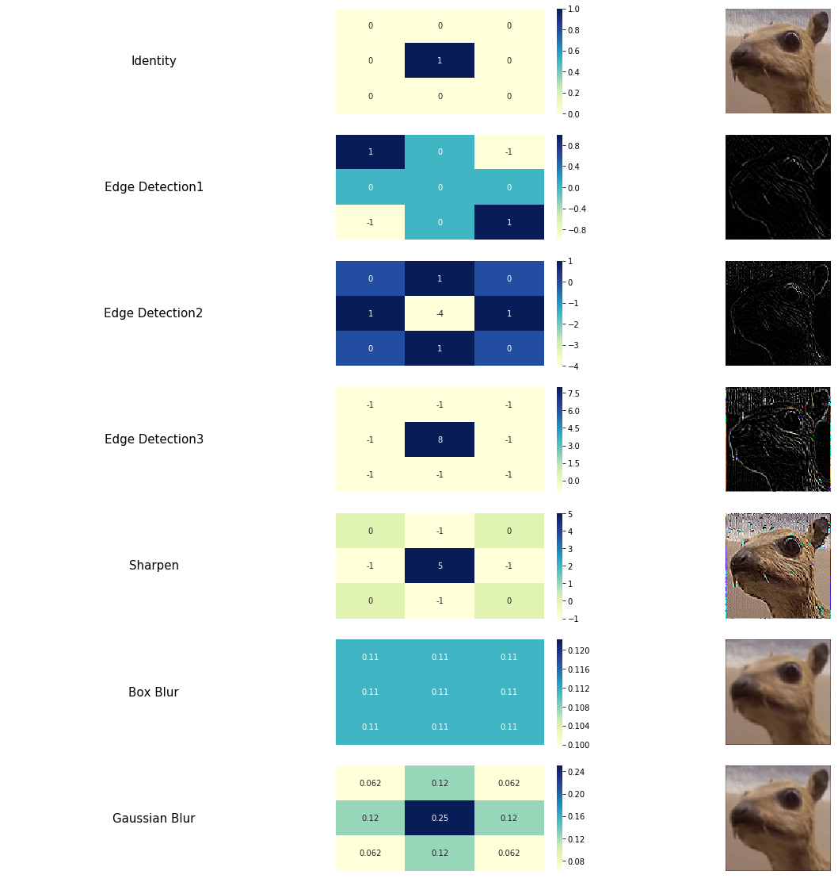

# Convolutional Neural Networks - Introduction
In my [last post](http://predictiveprogrammer.com/deep-learning-introduction-by-example/), we built a Neural Network that categorized fruit images into 60 different classes. 
But we did it using some helper functions that I wrote to lower down the complexity! 
In [this post](http://predictiveprogrammer.com/convolutional-neural-networks-introduction/), we will go a little into the nuts and bolts of what are Convolutional Neural Networks used in the last post. 
I'll also be addressing some concepts that I just introduced in the last post.

## What We Will be discussing?

### HOW DOES CONVOLUTION WORKS

### What are kernels?

### And A Little Bit of These

